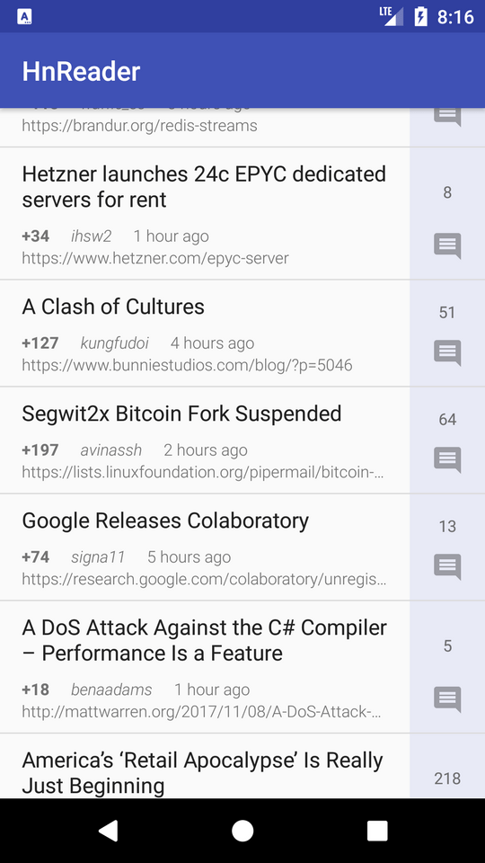

# HnReader

This is an example app demonstrating *Clean Architecture* on Android. It's built with *RxJava*, *Kotlin* and *Dagger*.

Clean Architecture and this example is detailed in two blog posts:
* [Clean Architecture on Android](http://lundgren.io/blog/clean-architecture-on-android/)
* [Clean Architecture on Android - Example app](http://lundgren.io/blog/clean-architecture-in-android-example-app/)

#### The app
The app is a simple Hacker News reader and looks like this:

